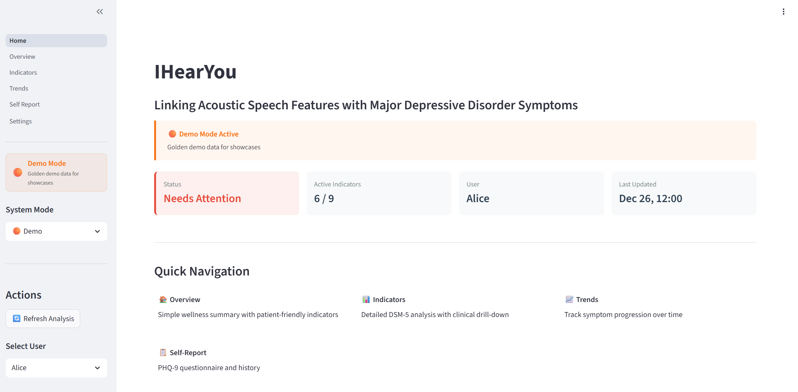
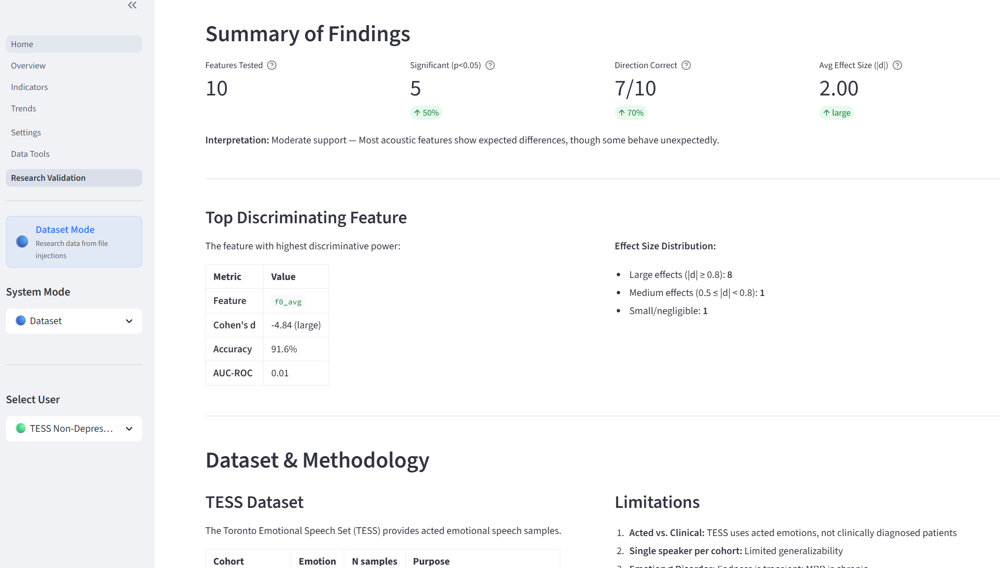
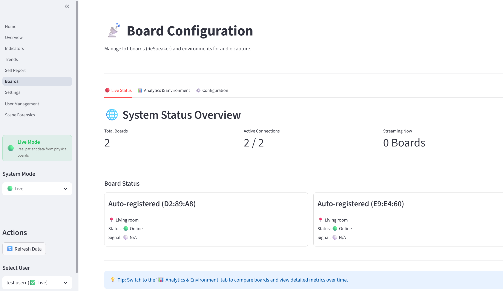

# IHearYou: Audio-Centered Depression Detection

A privacy-preserving, transparent AI system that detects Major Depressive Disorder (MDD) biomarkers in real-time by mapping acoustic features directly to DSM-5 clinical indicators. The prototype was initially developed by Jonas Lanzlinger as part of his master thesis at the University of St. Gallen.

## Key Features

- **Privacy-First Architecture**: Audio is processed at the edge; only extracted metrics leave the sensor node. No raw speech is stored.
- **"White-Box" Diagnostics**: Unlike black-box classifiers, this system maps specific acoustic features (e.g., Jitter, F0) to interpretable DSM-5 symptoms (e.g., Psychomotor Retardation).
- **Real-Time Monitoring**: Live dashboard for tracking symptom progression and vocal biomarkers over time.
- **Multi-Board Support**: Deploy multiple ReSpeaker boards throughout a household for comprehensive monitoring.
- **Speaker Verification**: Uses D-vector embeddings (Resemblyzer) to identify the target user and filter out other speakers.
- **Context-Aware Analysis**: Uses Temporal Context Modeling (EMA smoothing, daily aggregation) to distinguish fleeting moods from depressive episodes.
- **Explainable AI (XAI)**: Each indicator score includes confidence ratings, contributing metrics, and human-readable explanations.
- **Three Operating Modes**: Live (real patients), Dataset (research validation), and Demo (pre-seeded showcase data).

## System Modes

The dashboard supports three operating modes, each with its own isolated MongoDB database:

| Mode | Database | Description |
|------|----------|-------------|
| **Live** | `iotsensing_live` | Real patient data from physical ReSpeaker boards. Full access to all features including board management, user enrollment, and scene analysis. |
| **Dataset** | `iotsensing_dataset` | Research validation mode. Pre-loaded with TESS dataset cohorts (Depressed/Non-Depressed) for hypothesis testing and statistical analysis. |
| **Demo** | `iotsensing_demo` | Golden demo data for presentations and showcases. Pre-seeded with realistic patterns for two simulated users. |

### Demo Mode


### Dataset Mode


### Live Mode


## Data Pipeline Overview

The high-level data pipeline is illustrated below. Each step in the pipeline reflects a corresponding stage in the analysis of user data.


### Data Flow

```
Audio Input (ESP32 Board)
  → TCP Connection (MAC handshake) → ReSpeaker Service
  → Voice Activity Detection (Silero VAD)
  → MQTT: voice/{user_id}/{board_id}/{environment_name}
  → Scene Analysis (Speaker Verification + Context Classification)
  → Voice Metrics (20+ acoustic features) → raw_metrics (MongoDB)
  → Temporal Context Modeling (daily aggregation + EMA smoothing) → contextual_metrics
  → Analysis Layer (DSM-5 mapping + XAI explanations) → indicator_scores
  → Dashboard (visualization) + PHQ-9 Calibration
```

### Scene Analysis (Live Mode Gatekeeper)

In Live mode, the SceneResolver acts as a gatekeeper that:
1. **Verifies Speaker Identity**: Compares incoming audio against enrolled D-vector embeddings
2. **Classifies Context**: Maintains a 60-second sliding window to determine room context:
   - `solo_activity`: Target user speaking alone (>50% target user)
   - `social_interaction`: Multiple speakers present
   - `background_noise_tv`: Mostly noise/TV
3. **Filters Audio**: Only processes audio from the verified target user in appropriate contexts
4. **Logs Decisions**: All context decisions are stored in `scene_logs` for behavioral analysis

### MQTT Topic Structure

```
voice/{user_id}/{board_id}/{environment_name}
```

### DSM-5 Depression Indicators

The system maps acoustic features to 9 DSM-5 Major Depressive Disorder indicators:

1. Depressed mood
2. Loss of interest
3. Significant weight changes (set to 0 - not acoustically measurable)
4. Insomnia/hypersomnia
5. Psychomotor retardation/agitation
6. Fatigue/loss of energy
7. Feelings of worthlessness/guilt
8. Diminished ability to think/concentrate
9. Recurrent thoughts of death

Features are normalized using z-scores against population/user baselines, then mapped to indicators using configurable weights and correlation directions defined in [`config.json`](./analysis_layer/core/mapping/config.json).

### MongoDB Collections

| Collection | Purpose |
|------------|---------|
| `raw_metrics` | Raw audio features per utterance |
| `aggregated_metrics` | Daily aggregated metrics |
| `contextual_metrics` | EMA-smoothed metrics with context windows (morning/evening/general) |
| `analyzed_metrics` | Z-score normalized metrics |
| `indicator_scores` | Computed depression indicator scores with XAI explanations |
| `baseline` | User-specific baseline statistics |
| `user_config` | Per-user configuration overrides |
| `phq9_submissions` | PHQ-9 questionnaire responses for calibration |
| `users` | Registered users (name, age, gender) |
| `voice_profiling` | Voice enrollment data (D-vectors for speaker verification) |
| `boards`, `environments` | Multi-board IoT configuration |
| `scene_logs` | Scene analysis decisions (speaker verification, context) |
| `audio_quality_metrics` | Real-time audio quality measurements (SNR, clipping, dBFS) |

## Dashboard Pages

| Page | Description | Available In |
|------|-------------|--------------|
| **Home** | System overview, mode selection, quick navigation | All modes |
| **Overview** | Patient-friendly wellness summary with wellness score | All modes |
| **Indicators** | DSM-5 clinical analysis with XAI explanations, waterfall charts | All modes |
| **Trends** | Symptom progression over time with trend analysis | All modes |
| **Self-Report** | PHQ-9 questionnaire submission and history | Live, Demo |
| **Boards** | ReSpeaker board configuration and audio quality monitoring | Live only |
| **User Management** | User registration and voice enrollment/calibration | Live only |
| **Data Tools** | Audio injection, hypothesis testing, data export, research validation | Dataset only |
| **Scene Forensics** | Scene analysis logs and speaker verification debugging | Live only |

## Services Overview

| Service Name | Container Name | Port | URL / Notes |
|--------------|----------------|------|-------------|
| MQTT Broker | `mqtt` | 1883 | MQTT protocol only |
| MongoDB | `mongodb` | 27017 | MongoDB database |
| Mongo Express | `mongo-express` | 8081 | [http://localhost:8081](http://localhost:8081) |
| Voice Profiling Service | `voice_profiling` | 8000 | [http://localhost:8000](http://localhost:8000) |
| Voice Metrics Service | `voice_metrics` | – | Internal only (MQTT consumer) |
| ReSpeaker Service | `respeaker_service` | 8010 | TCP server for ESP32 board connections |
| Quality Metrics Service | `quality_metrics_service` | – | Internal only (audio quality monitoring) |
| Temporal Context Modeling | `temporal_context_modeling_layer` | 8082 | [http://localhost:8082](http://localhost:8082) |
| Analysis Layer | `analysis_layer` | 8083 | [http://localhost:8083](http://localhost:8083) |
| Dashboard Layer | `dashboard_layer` | 8084 | [http://localhost:8084](http://localhost:8084) |

## Quick Start

### Option 1: Demo Mode (No Hardware Required)

1. **Build and start the system:**
   ```bash
   docker-compose up --build
   ```

2. **Seed demo data:**
   ```bash
   python scripts/seed_demo_data.py
   ```

3. **Open the dashboard:**
   Navigate to [http://localhost:8084](http://localhost:8084). The system defaults to Demo mode with pre-seeded data for "Alice" (depressed pattern) and "Bob" (healthy pattern).

### Option 2: Dataset Mode (Research Validation)

1. **Start the system:**
   ```bash
   docker-compose up --build
   ```

2. **Seed TESS dataset:**
   ```bash
   python scripts/seed_dataset_mode.py
   ```

3. **Switch to Dataset mode:**
   In the dashboard sidebar, select "Dataset" mode. You'll see two virtual users:
   - TESS Depressed (Sad emotion)
   - TESS Non-Depressed (Happy emotion)

4. **Run analysis:**
   Click "Refresh Analysis" to compute indicator scores.

### Option 3: Live Mode (Physical Hardware)

1. **Flash ESP32 boards:**
   - Copy `data_ingestion_layer/board-code/credentials.example.h` to `credentials.h`
   - Fill in your WiFi SSID, password, and server IP
   - Flash `respeaker.ino` to your ReSpeaker Lite + XIAO ESP32S3

2. **Start the system:**
   ```bash
   docker-compose up --build
   ```

3. **Register a user:**
   - Switch to Live mode in the dashboard
   - Go to User Management
   - Register a new user and enroll their voice profile

4. **Configure boards:**
   - Go to Boards page
   - Register boards by MAC address
   - Assign boards to environments (e.g., "Living Room", "Bedroom")

5. **Monitor:**
   Once boards connect and stream audio, the system will process and analyze automatically.

### Option 4: File Injection (Testing)

For testing without hardware, inject a WAV file directly:

```bash
python data_ingestion_layer/dataset_injector.py --file path/to/audio.wav --user_id test_user
```

## Hardware Setup

### Supported Boards

- **ReSpeaker Lite** with XIAO ESP32S3 (primary, tested)
- **ReSpeaker XVF3800** with XIAO ESP32S3 (supported)

### Board Configuration

1. Copy credentials template:
   ```bash
   cp data_ingestion_layer/board-code/credentials.example.h data_ingestion_layer/board-code/credentials.h
   ```

2. Edit `credentials.h` with your network details:
   ```cpp
   const char* ssid     = "YOUR_WIFI_SSID";
   const char* password = "YOUR_WIFI_PASSWORD";
   const char* host     = "YOUR_SERVER_IP";  // Machine running respeaker_service
   ```

3. Flash using Arduino IDE or PlatformIO.

**Note:** `credentials.h` is gitignored to prevent credential leaks.

## Technology Stack

**Audio Processing:**
- Librosa - General feature extraction
- OpenSMILE - Acoustic features
- Praat-Parselmouth - Prosodic analysis
- Resemblyzer - Speaker embeddings (D-vectors)
- Silero VAD - Voice activity detection
- WebRTC VAD - Additional VAD support
- PyTorch/TorchAudio 2.5.1

**Backend:**
- Python 3.9-3.11
- FastAPI (REST APIs)
- Streamlit (Dashboard)
- MongoDB (Persistence)
- MQTT/Mosquitto (Message broker)

**Hardware:**
- ReSpeaker Lite / XVF3800
- XIAO ESP32S3
- Arduino Framework

## Project Structure

```
depression-detection/
├── analysis_layer/           # DSM-5 mapping and XAI explanations
│   ├── core/
│   │   ├── mapping/          # config.json with feature-to-indicator mapping
│   │   ├── models/           # Data models
│   │   └── services/         # Scoring and explanation generation
├── dashboard_layer/          # Streamlit dashboard
│   ├── pages/                # Dashboard pages (Overview, Indicators, etc.)
│   ├── utils/                # Shared utilities
│   └── assets/               # Images and static files
├── data_ingestion_layer/     # Audio ingestion
│   ├── board-code/           # ESP32 Arduino firmware
│   ├── respeaker_service.py  # TCP server for board connections
│   └── dataset_injector.py   # WAV file injection
├── processing_layer/
│   ├── metrics_computation/  # Voice feature extraction
│   │   └── voice_metrics/    # OpenSMILE, Librosa, Praat integration
│   ├── scene_analysis/       # Speaker verification and context
│   └── user_profiling/       # Voice enrollment service
├── temporal_context_modeling_layer/  # EMA smoothing and aggregation
├── scripts/                  # Utility scripts
│   ├── seed_demo_data.py     # Seed demo mode data
│   └── seed_dataset_mode.py  # Seed dataset mode with TESS
├── datasets/                 # Audio files for testing
├── docs/                     # Documentation and research data
└── docker-compose.yml        # Container orchestration
```

## Research Validation

The Dataset mode includes tools for research validation:

- **Hypothesis Testing**: Mann-Whitney U tests with FDR correction
- **Effect Size Analysis**: Cohen's d for each acoustic feature
- **PHQ-8 Correlation**: Validate against clinical scores (DAIC-WOZ pending)
- **Classification Metrics**: Sensitivity, Specificity, PPV, NPV, AUC-ROC
- **Feature Explorer**: Violin plots and distribution analysis

### Current Datasets

| Dataset | Status | Description |
|---------|--------|-------------|
| **TESS** | Available | Toronto Emotional Speech Set. Sad emotion as depression proxy. |
| **DAIC-WOZ** | Pending Access | Clinical interviews with PHQ-8 scores. |

## Configuration

### Scene Analysis (`processing_layer/scene_analysis/scene_config.json`)

```json
{
  "similarity_threshold_high": 0.75,
  "similarity_threshold_low": 0.55,
  "buffer_size": 60,
  "solo_activity_ratio": 0.5,
  "background_noise_ratio": 0.7
}
```

### Feature-to-Indicator Mapping (`analysis_layer/core/mapping/config.json`)

Defines which acoustic features map to which DSM-5 indicators, with weights and correlation directions.

## Contributing

1. Fork the repository
2. Create a feature branch
3. Make your changes
4. Run tests: `python -m pytest dashboard_layer/tests/`
5. Submit a pull request

## License

This project is part of academic research. Please contact the authors for licensing inquiries.

## Dataset Attributions

### TESS (Toronto Emotional Speech Set)

This project uses the TESS dataset for research validation. TESS is licensed under [CC BY-NC-ND 4.0](https://creativecommons.org/licenses/by-nc-nd/4.0/).

> Dupuis, K., & Pichora-Fuller, M. K. (2010). *Toronto Emotional Speech Set (TESS)*.
> University of Toronto, Psychology Department.
> https://doi.org/10.5683/SP2/E8H2MF

The dataset contains recordings of 200 target words spoken by two actresses portraying seven emotions (anger, disgust, fear, happiness, pleasant surprise, sadness, and neutral). In this project, sad emotion is used as a proxy for depressed speech patterns, and happy emotion represents non-depressed controls.

## Acknowledgments

- Jonas Lanzlinger - Original prototype development (University of St. Gallen)
- Kate Dupuis & M. Kathleen Pichora-Fuller - TESS Dataset (University of Toronto)
- Resemblyzer - Speaker embedding library
